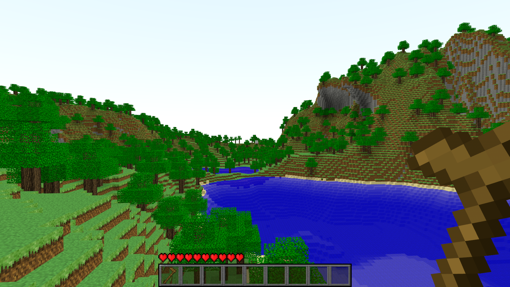

# Fmc 


# How to build
Rust nightly **required**
```
cd server && cargo run --release
cd client && cargo run --release
```
# Controls
| keys             | description                                                                 |
| ---------        | -----------                                                                 |
| `escape`           | Pause                                                                       |
| `WASD`             | Move                                                                        |
| `spacebar`         | Jump/Fly, double tap to toggle flight                                       |
| `shift`            | Fly down                                                                    |
| `control`          | Speed up horizontal flight                                                  |
| `e`                | inventory                                                                   |

# Licensing
You can find the licenses in the respective directories

client                - AGPL
server                - GPL
crates/fmc            - LGPL
crates/fmc_networking - MIT
crates/fmc_noise      - MIT
