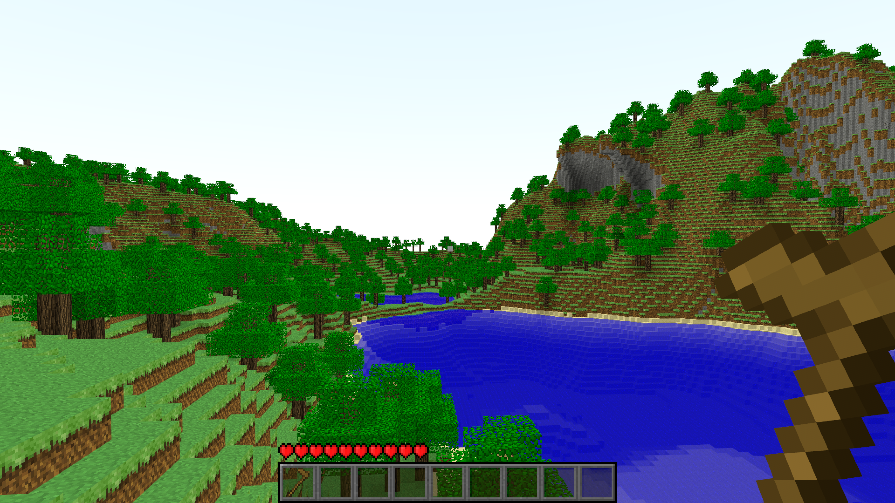

# Fmc 


# How to run
```
cd client && cargo run --release
```

Singleplayer takes a little while to work as it must download the server(10mb).

# Controls
| keys               | description                          |
| ----               | -----------                          |
| `escape`           | Pause                                |
| `WASD`             | Move                                 |
| `spacebar`         | Jump/Fly, double tap to toggle flight|
| `shift`            | Fly down                             |
| `control`          | Speed up horizontal flight           |
| `e`                | inventory                            |

# Licensing
[client](./client/) - AGPLv3  
[fmc](./fmc/)    - MIT or Apache-2.0
